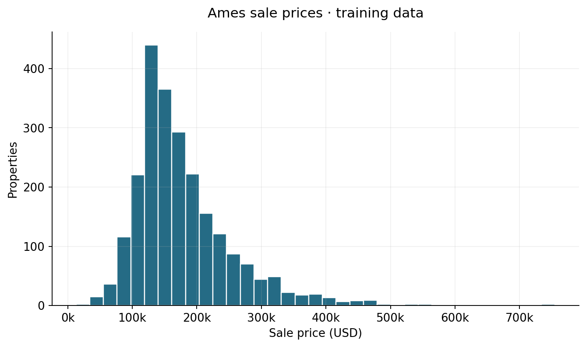
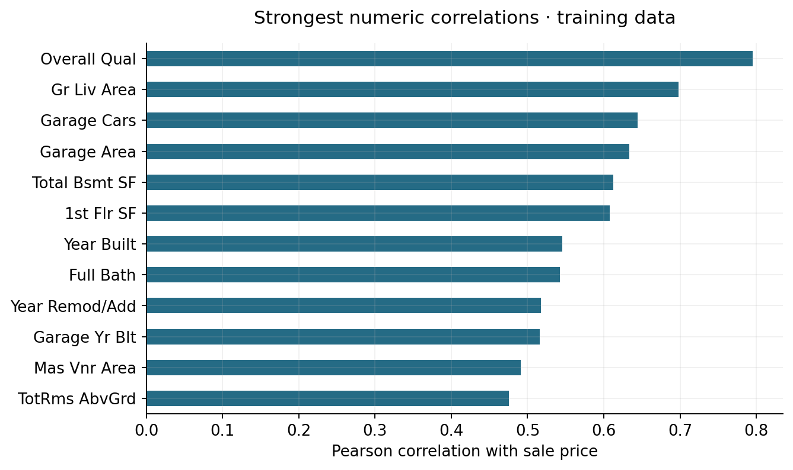
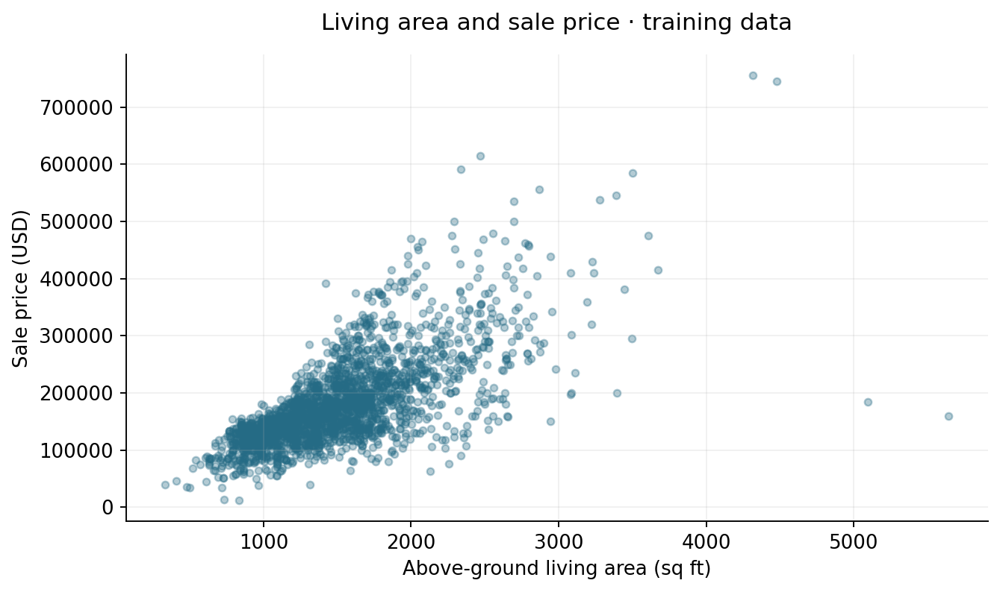
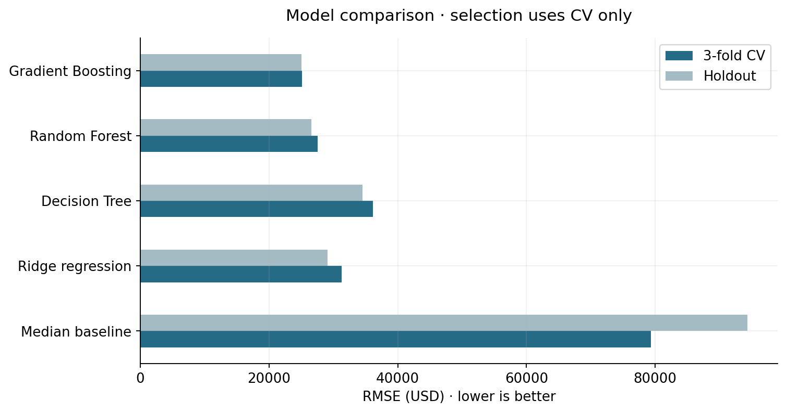
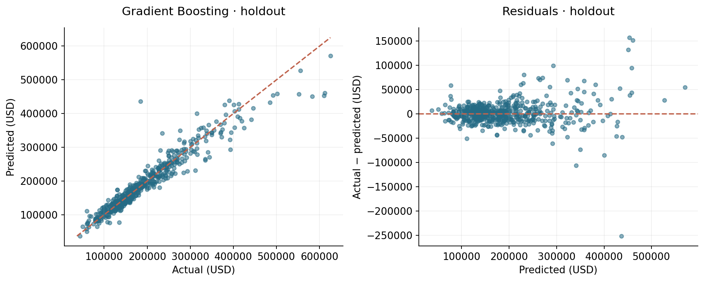
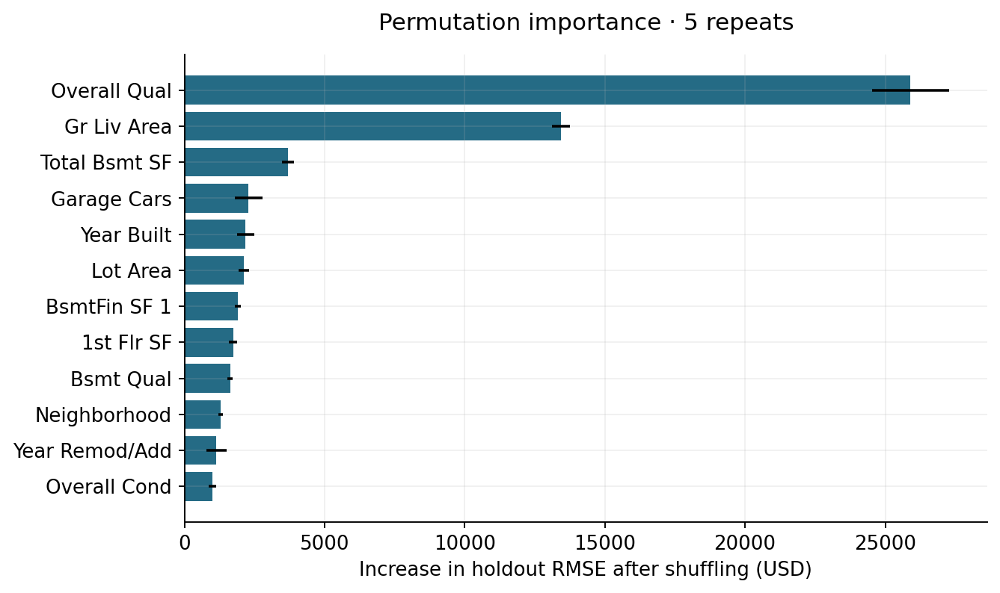

# Apartment Price Prediction

Модель оценивает стоимость дома по площади, району, возрасту здания и другим характеристикам.
Лучший результат по кросс-валидации у Gradient Boosting: на тестовой выборке средняя
абсолютная ошибка составляет $14,968, RMSE — $25,054.

## Данные

Ames Housing: 2,930 продаж жилой недвижимости в городе Эймс, штат Айова, за 2006–2010 годы.
В наборе преимущественно дома. Цена `SalePrice` указана в долларах на момент сделки,
площадь — в квадратных футах.

[Описание набора](https://jse.amstat.org/v19n3/decock.pdf) ·
[Данные](https://jse.amstat.org/v19n3/decock/AmesHousing.txt) ·
[Словарь признаков](https://jse.amstat.org/v19n3/decock/DataDocumentation.txt)

Источник и контрольная сумма файла записаны в [data/source.json](data/source.json).





## Подготовка и обучение

Для обучения используются 2,344 объекта, для проверки — 586; `random_state=42`.
Графики анализа данных построены по обучающей части.

В модели передаются 75 признаков. Идентификаторы и сведения о самой сделке
(`Order`, `PID`, `Mo Sold`, `Yr Sold`, `Sale Type`, `Sale Condition`) исключены.
Числовые пропуски заполняются медианой, добавляются индикаторы пропусков и масштабирование.
Категории кодируются через one-hot; редкие значения объединяются.
Код `MS SubClass` рассматривается как категория. Значение `NA`, обозначающее отсутствие
подвала или другого объекта, отличается от пустой ячейки.

Обработка признаков и модель объединены в `Pipeline`.
Параметры подбираются на трёх разбиениях обучающей части; выбор модели — по минимальному RMSE.
Базовый прогноз для сравнения — медианная цена в обучающей выборке.

## Результаты

RMSE выбран основной метрикой, поскольку крупные ошибки в цене важны для этой задачи.
MAE показывает средний промах в долларах, MSE — среднюю квадратичную ошибку в долларах²,
R² сравнивает прогноз со средней ценой тестовой выборки.

| Модель | CV RMSE ± std, $ | Test MAE, $ | Test MSE, $² | Test RMSE, $ | Test R² |
|---|---|---|---|---|---|
| Median baseline | 79,376 ± 2,237 | 63,838 | 8,896,757,562 | 94,323 | -0.110 |
| Ridge regression | 31,256 ± 6,087 | 16,729 | 846,327,891 | 29,092 | 0.894 |
| Decision Tree | 36,121 ± 2,111 | 22,340 | 1,191,141,619 | 34,513 | 0.851 |
| Random Forest | 27,556 ± 3,324 | 15,653 | 706,189,264 | 26,574 | 0.912 |
| Gradient Boosting | 25,146 ± 4,313 | 14,968 | 627,706,442 | 25,054 | 0.922 |

`std` — разброс результатов между тремя разбиениями.
У выбранного Gradient Boosting 200 деревьев, глубина 3 и `learning_rate=0.05`.
Параметры и метрики сохранены в [summary.json](reports/summary.json).



## Ошибки модели



Средняя абсолютная ошибка в самом дорогом квартиле — $24,880, во втором — $9,452.
Границы квартилей рассчитаны по обучающим данным.
Один из крупных промахов: дом площадью 4,676 кв. футов продан за $184,750,
модель оценила его в $436,381.
Все прогнозы находятся в [test_predictions.csv](reports/test_predictions.csv).



Перемешивание `Overall Qual` увеличивает RMSE примерно на $25,905,
`Gr Liv Area` — на $13,435. Это оценка важности признака для прогноза;
связанные между собой признаки могут делить влияние.
Расчёты сохранены в [permutation_importance.csv](reports/permutation_importance.csv).

Бустинг снижает RMSE на 73.4% относительно прогноза медианой, но чаще ошибается
на дорогих объектах. Следующий эксперимент — разделение по году продажи и сравнение
с обучением на `log1p(SalePrice)`. Для цен в другом городе или в другие годы нужны новые данные.

## Запуск

Python 3.12. Команды для PowerShell из папки `apartment-price-prediction`:

```powershell
python -m venv .venv
.\.venv\Scripts\Activate.ps1
python -m pip install -r requirements.txt
python -m pytest -q
python run.py
python predict.py example_input.csv --output predictions.csv
```

В Linux и macOS окружение активируется командой `source .venv/bin/activate`.

`run.py` скачивает данные, обучает модели и сохраняет графики и отчёты.
Для первой загрузки нужен интернет. Выбранная модель записывается в `models/best_model.joblib`.
`predict.py` принимает CSV с исходными признаками; в `example_input.csv` есть три строки для проверки запуска.
