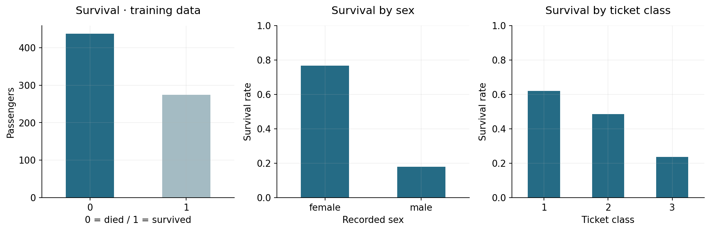
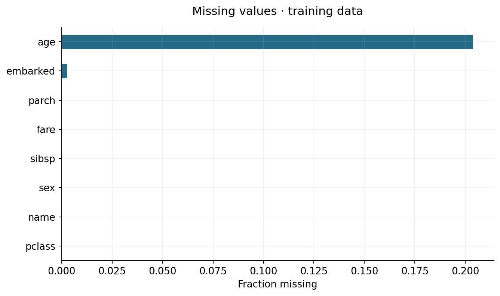
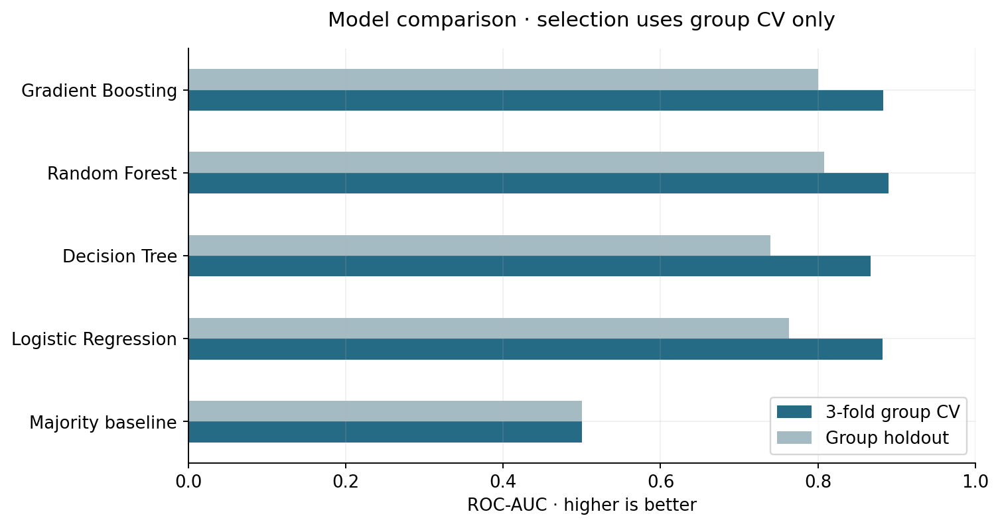
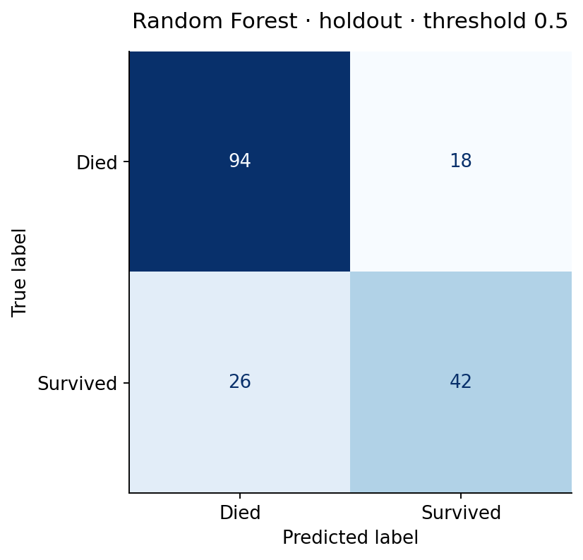
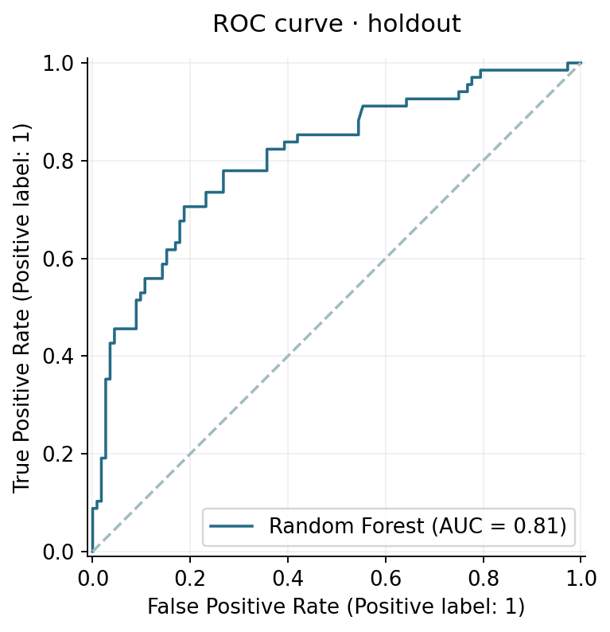
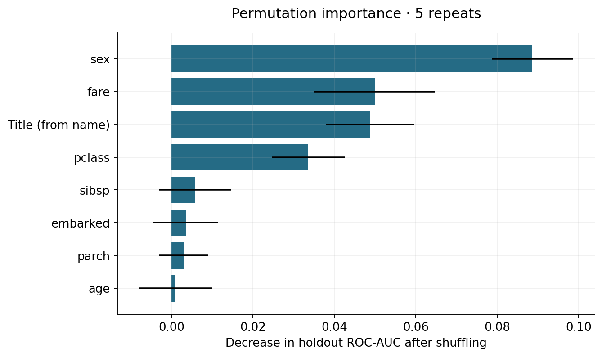

# Titanic Survival Classification

**Классификация с feature engineering и разделением по группам билетов.**
Выбранная по CV модель — **Random Forest**: holdout ROC-AUC **0.808**,
Accuracy **0.756**, F1 **0.656**. Все числа получены запуском кода.

## Задача и данные

Предсказать `survived` (1 — выжил) по сведениям о пассажире до катастрофы.
**891 пассажир** из реального Titanic training set. Использована raw-версия из
[официального репозитория данных seaborn](https://github.com/mwaskom/seaborn-data/blob/master/raw/titanic.csv),
который указывает [Kaggle Titanic](https://www.kaggle.com/c/titanic/data) как источник.
Снимок проверяется по SHA-256 из [data/source.json](data/source.json).
Это локальная holdout-оценка, а не результат на leaderboard Kaggle.

## EDA и подготовка




Используются возраст, тариф, класс, пол, порт посадки и число родственников.
Feature engineering внутри Pipeline: `family_size = sibsp + parch + 1`, `is_alone`,
`fare_per_person`, title из имени (`Mr`, `Mrs`, `Miss`, `Master`, остальные → `Other`).
Правила заданы заранее и не зависят от target. Полное имя в модель не передаётся;
номер билета используется **только для разделения данных**. Cabin исключён из базового набора.

Числовые пропуски заполняются медианой train fold с missing indicators;
числа стандартизируются. Категории заполняются Unknown и one-hot кодируются;
неизвестные test-категории обрабатываются без падения. `pclass` считается категорией.
В preprocessing действует allowlist: target и производные `alive`, а также сведения о
спасении вроде `boat` / `body` не могут попасть в признаки.

## Протокол оценки

- Один заранее выбранный fold из **5-fold StratifiedGroupKFold** даёт **711 train / 180 test**, seed 42.
- Группа — нормализованный ticket: общих билетов между train/test **0**.
  Это снижает зависимость между попутчиками, но не гарантирует разделения всех семей с разными билетами.
- На train выполнена **3-fold StratifiedGroupKFold** с небольшими grid search.
- Победитель выбран по CV ROC-AUC, затем зафиксирован и оценён на test.
- Для Accuracy/Precision/Recall/F1 используется стандартный threshold 0.5; он не подбирался по test.
- Survival rate: train **0.385**, test **0.378**.
  Группы не позволяют гарантировать точное совпадение долей классов или размер split ровно 20%.

ROC-AUC оценивает ранжирование вероятностей независимо от выбранного порога, поэтому используется
для выбора модели. Accuracy сравнивается с majority baseline: при дисбалансе одна доля правильных
ответов недостаточна. Precision отвечает, сколько предсказанных выживших действительно выжили;
Recall — сколько выживших обнаружены. F1 показывает баланс этих двух величин при данном пороге.
Confusion matrix показывает конкретные FP/FN; ROC-AUC не измеряет калибровку вероятностей.

## Модели и результаты

Majority baseline, Logistic Regression, Decision Tree, Random Forest и Gradient Boosting.
Параметры выбранной модели: `{"model__max_depth": null, "model__min_samples_leaf": 5}`.
Полные кандидаты и результаты folds сохранены в [reports/](reports/).

| Модель | CV ROC-AUC ± std | Accuracy | Precision | Recall | F1 | Test ROC-AUC |
| --- | --- | --- | --- | --- | --- | --- |
| Majority baseline | 0.500 ± 0.000 | 0.622 | 0.000 | 0.000 | 0.000 | 0.500 |
| Logistic Regression | 0.882 ± 0.023 | 0.756 | 0.694 | 0.632 | 0.662 | 0.763 |
| Decision Tree | 0.867 ± 0.022 | 0.728 | 0.651 | 0.603 | 0.626 | 0.740 |
| Random Forest | 0.889 ± 0.020 | 0.756 | 0.700 | 0.618 | 0.656 | 0.808 |
| Gradient Boosting | 0.883 ± 0.017 | 0.750 | 0.677 | 0.647 | 0.662 | 0.800 |

CV std — разброс folds, не доверительный интервал. Лучший CV score использован при настройке
и может быть оптимистичным. Разница между CV **0.889** и holdout
**0.808** существенна: данных мало, группы дают нестабильные оценки.
Эта разница сохранена в отчёте, а test не использовался для исправления scores.





## Ошибки и интерпретация

При threshold 0.5: TN **94**, FP **18**, FN **26**, TP **42**.
Recall **0.618** означает, что заметная часть фактически выживших не обнаружена.
ROC-AUC лучше baseline, но качество решений при конкретном пороге требует отдельного внимания.
Random Forest выбран по ROC-AUC; это не означает, что он лучший по каждой метрике в таблице.

| Группа | Пассажиров test | Доля ошибок |
| --- | --- | --- |
| female | 65 | 0.323 |
| male | 115 | 0.200 |

Группы малы, и различие ошибок — диагностическое наблюдение, а не доказательство причин.
[misclassified.csv](reports/misclassified.csv) содержит конкретные ошибки без полных имён,
а [test_predictions.csv](reports/test_predictions.csv) — все labels и вероятности.



Importance рассчитана перемешиванием исходных признаков на test, 5 повторов; `name`
на графике означает title, извлечённый из имени, а не запоминание имени. Связанные признаки
могут делить importance. Значения не являются причинными выводами; после анализа модель не перенастраивалась.

## Выводы и следующий шаг

Групповое разделение даёт честную проверку на новых билетах. Pipeline показывает полный путь
от пропусков и категорий до воспроизводимого сравнения. Сильный CV score не гарантирует
такого же качества на небольшой отдельной выборке.

Следующий эксперимент — повторная group CV для оценки нестабильности, отдельная validation
часть для выбора порога и проверки калибровки, сравнение групп по ticket и семейному идентификатору.
Текущий test после диагностики не следует снова использовать для настройки.
Данные исторические; модель предназначена для учебного анализа, а не принятия решений о людях.

## Воспроизведение

Python 3.12, из корня репозитория:

```bash
python -m venv .venv
source .venv/bin/activate
python -m pip install -r requirements-lock.txt
python -m pytest -q
python run.py
python predict.py example_input.csv --output predictions.csv
```

В Windows вместо `source .venv/bin/activate` используйте `.venv\Scripts\Activate.ps1`.

Для первой загрузки нужен интернет; дальше используется проверенный cache.
`example_input.csv` содержит три исходные строки train без target и нужен только для демонстрации inference.
Модель сохраняется в `models/best_model.joblib`, графики — `images/`, фактические таблицы — `reports/`.
[analysis.ipynb](notebooks/analysis.ipynb) показывает EDA и диагностику из тех же артефактов;
Jupyter можно установить отдельно для его интерактивного открытия.

```text
├── src/titanic/
├── tests/
├── notebooks/
├── data/
├── reports/
├── images/
├── run.py
└── predict.py
```
