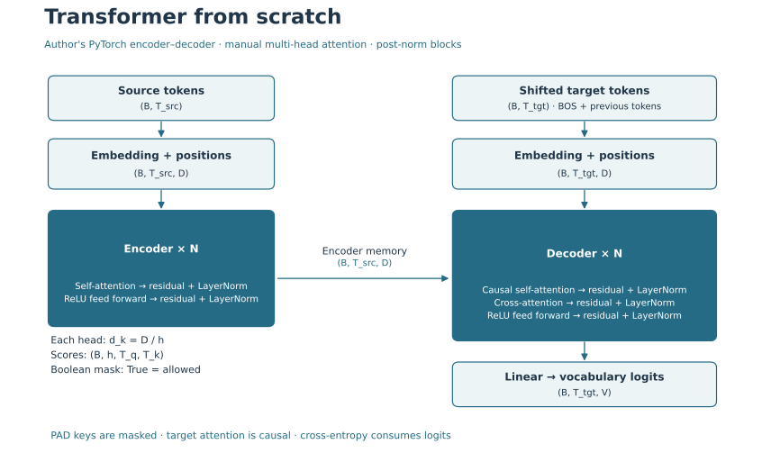
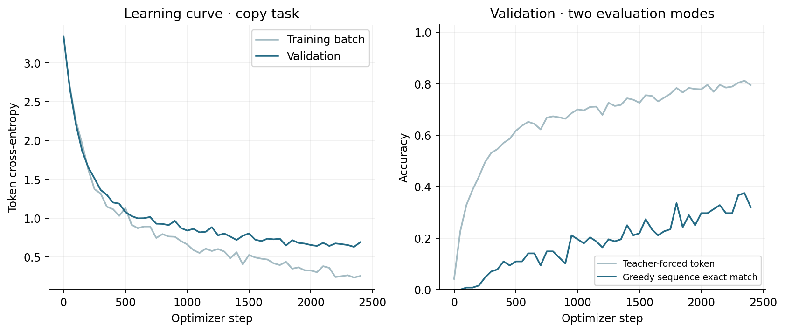

# Transformer From Scratch · PyTorch

**Encoder–decoder Transformer, реализованный с нуля на PyTorch.**
Multi-Head Attention, positional encoding, encoder и decoder реализованы отдельными модулями.
Проект включает обучение на copy task, autoregressive generation и тесты.
Attention вычисляется вручную через Q/K/V projections и матричные операции,
без готовых `nn.Transformer` и `nn.MultiheadAttention`.



`Input → Embedding + Positional Encoding → Encoder → Decoder → Linear → Vocabulary`

Source проходит в encoder; decoder получает BOS и сдвинутые target-токены,
а также память encoder через cross-attention. Linear возвращает logits по словарю.

## Архитектура и формы тензоров

`B` — batch size; `T` — sequence length; `D` — d_model; `V` — vocabulary size;
`h` — number of heads; `d_k = D / h`; `N` — число Transformer blocks.
`T_src` и `T_tgt` могут различаться.

| Компонент | Форма |
|---|---|
| Input tokens | `(B, T_src)` / `(B, T_tgt)` |
| Embedding + positional encoding | `(B, T, D)` |
| Q/K/V после разделения heads | `(B, h, T, d_k)` |
| Self-attention scores | `(B, h, T, T)` |
| Decoder cross-attention scores | `(B, h, T_tgt, T_src)` |
| Feed Forward Network | `(B, T, D)` → `(B, T, D_ff)` → `(B, T, D)` |
| Linear output logits | `(B, T_tgt, V)` |

Encoder block: `Self-attention → Add + LayerNorm → FFN → Add + LayerNorm`.
Decoder block: `Causal self-attention → Add + LayerNorm → Cross-attention → Add + LayerNorm → FFN → Add + LayerNorm`.
LayerNorm применяется **после** сложения residual. Dropout остаётся в embedding;
attention/residual dropout из оригинальной статьи пока не добавлены.

$$Attention(Q,K,V) = softmax(QK^T / \sqrt{d_k} + M)V$$

Boolean masks в коде: **True разрешает**, False закрывает attention.
`Transformer.forward` принимает `src_mask` и `tgt_mask` явно. Для обучения и генерации
они создаются в `training_helpers.py`; без `tgt_mask` causal masking не применяется.
Source padding mask: `(B, 1, 1, T_src)`; combined target mask: `(B, 1, T_tgt, T_tgt)`.
Верхний треугольник target mask закрыт, поэтому будущие target-токены недоступны.
На fully masked строках веса принудительно равны нулю; выход W_o может содержать bias.
Loss не учитывает PAD. 

## Обучение на copy task

Задача **синтетического копирования последовательности**, а не перевод или real-text NLP benchmark.
Она проверяет, что attention, masks, teacher forcing, backpropagation и генерация работают вместе.
Каждая последовательность содержит 3–7 token IDs из `[3, 23]`; PAD=0, BOS=1, EOS=2.
Словарь V=24. Целевая последовательность совпадает с source; EOS должен быть сгенерирован.

- Train: **1024**, validation: **128**, final test: **128** уникальных последовательностей без пересечений.
- Train seed=42, validation seed=43, final test seed=45.
- D=32, h=4, d_k=8, D_ff=64, N=2, max_len=16, embedding dropout=0.1.
- Параметров: **45,080**. CPU, PyTorch **2.8.0+cpu**.
- Adam lr=0.001, batch=64, gradient clipping=1.0, **2400 steps**.
- Target input = BOS + предыдущие токены; labels = следующие токены + EOS.
- CrossEntropyLoss принимает logits, `ignore_index=PAD`. Softmax перед loss не используется.
- Checkpoint выбран по минимальному validation loss на step **2350**.
  Test оценивается после выбора checkpoint.

Конфигурация и протокол оценки записаны в [summary.json](reports/summary.json),
а история обучения — в [training_history.csv](reports/training_history.csv).

| Оценка | Фактическое значение |
|---|---:|
| Initial validation cross-entropy | 3.3370 |
| Selected validation cross-entropy | 0.6312 |
| Final test cross-entropy | 0.6317 |
| Final test teacher-forced token accuracy | 80.876% |
| Final test greedy sequence exact match | 32.812% |

Teacher-forced token accuracy получает правильный предыдущий target-токен.
Greedy exact match генерирует **всю последовательность самостоятельно**, включая EOS;
одна неверная позиция делает весь пример ошибочным. Поэтому две метрики нельзя смешивать.



- Успешный пример: input `[16, 18, 11, 5, 12]` → generated `[16, 18, 11, 5, 12]`; EOS: `True`.
- Ошибка: input `[3, 5, 18, 3, 6]` → generated `[3, 5, 18, 6]`; EOS: `True`.

Все 128 примеров доступны в [test_generations.json](reports/test_generations.json).
Greedy exact match 32.8% остаётся ограниченным: разрыв с token accuracy показывает,
что корректный следующий токен при teacher forcing ещё не гарантирует самостоятельное
копирование целиком. Training loss заметно ниже validation loss, поэтому дальнейшее
увеличение числа steps само по себе не устраняет ограничение обобщения.
Это не доказательство качества перевода или готовности модели к работе с текстом.
Поведение проверено на небольшой конфигурации CPU; перенос на GPU и длинные тексты отдельно не оценивался.

## Тестирование

22 теста: независимая сверка attention через einsum, разные T_src/T_tgt,
causal invariance, padding keys, неизменность повторно переданных masks,
finite forward/backward, градиенты через encoder/decoder/FFN, state_dict,
dropout train/eval, odd D positional encoding, некорректные heads/masks/длина,
раздельные datasets, tiny overfit, интерфейсы классов и работа явно переданных masks.

## Запуск после клонирования

Python 3.12; команды из папки `transformer-from-scratch`:

```bash
python -m venv .venv
source .venv/bin/activate
python -m pip install -r requirements.txt
python -m pytest -q
python train.py
python generate.py 3 7 12 4
```

В Windows вместо `source .venv/bin/activate` используйте `.venv\Scripts\Activate.ps1`.

`requirements.txt` использует CPU-wheel из официального PyTorch index.
Обучение создаёт `checkpoints/copy_model.pt`; checkpoint не коммитится в Git.
`generate.py` читает только state_dict и конфигурацию с `weights_only=True`.
Отдельные `--steps`, `--seed`, `--test-seed`, `--device` позволяют создать новый эксперимент,
но изменённая конфигурация уже не воспроизводит таблицу выше.

```text
├── Transformer.py
├── MultiHeadAttention.py
├── InputEmbedding.py
├── Encoder.py / Encoder_Block.py
├── Decoder.py / Decoder_Block.py
├── FeedForward.py / AddNorm.py
├── masks.py
├── training_helpers.py
├── tests/
├── data/
├── reports/
├── images/
├── train.py
└── generate.py
```

## Ограничения и развитие

Соответствие оригинальной статье не заявляется полностью: отсутствуют её training recipe,
attention/residual dropout и реальный переводческий benchmark.
Следующий шаг — tokenizer и открытый корпус, отдельный data protocol, scheduler/warmup
и сравнение с простой seq2seq baseline.

Статья: [Attention Is All You Need](https://arxiv.org/abs/1706.03762).
